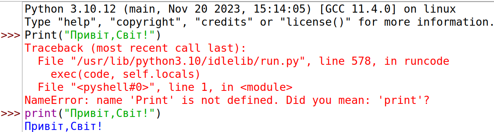
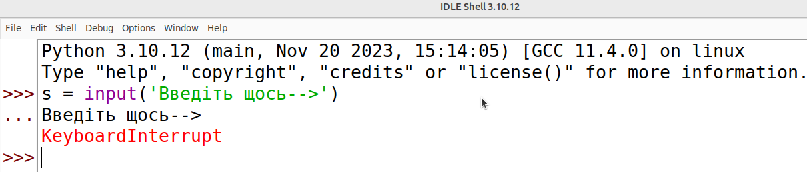
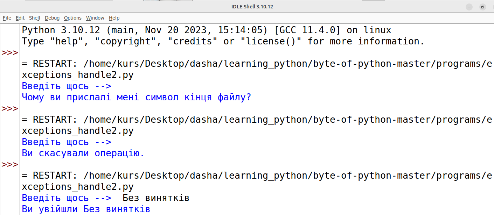

# Винятки
{w=40px}{bdg-secondary-line}`англійська:` _Exceptions_

Винятки трапляються, коли у вашій програмі виникають _виняткові_ (_exceptional_) ситуації. Наприклад,якщо ви збираєтеся прочитати файл, а файл не існує? Або, якщо ви випадково видалили файл під час роботи програми? Такі ситуації обробляються за допомогою **винятків** (англ."**exceptions**").

Подібним чином, якби ваша програма мала деякі неприпустимі команди? У цьому випадку Python  **піднімає** (англ."**raises**")руки та повідомляє, що виявив **помилку** (англ."**error**").

##  Помилки
{w=40px}{bdg-secondary-line}`англійська:` _Errors_

Розглянемо простий виклик функції `print`. Що, якщо ми помилково напишемо `print` як `Print`? Зверніть увагу на використання великих літер (англ."capitalization"). У цьому випадку Python _піднімає_ синтаксичну помилку.

Приклад англійською:

```python
>>> Print("Hello World")
Traceback (most recent call last):
  File "<stdin>", line 1, in <module>
NameError: name 'Print' is not defined
>>> print("Hello World")
Hello World
```
 Приклад українською (скріншот, зроблений в оболонці Python за допомогою IDLE):


де:
 name 'Print' is not defined.Did you mean:'print'? - ім'я «Print» не визначено. Ви мали на увазі :'print'? 

Зверніть увагу, що була підіймана помилка`NameError`,а також друкується місце, де було виявлено помилку. Так у цьому випадку діє **обробник помилок** (англ."**error handler**").

## Винятки
{w=40px}{bdg-secondary-line}`англійська:` _Exceptions_

Ми **спробуємо** (англ."**try**") прочитати щось від користувача. Введіть перший рядок нижче та натисніть клавішу `Enter`. Коли ваш комп’ютер запропонує вам ввести дані, натомість натисніть `[ctrl-d]` на Mac або `[ctrl-z]` на Windows і подивіться, що станеться. (Якщо ви користуєтеся Windows і жоден із варіантів не працює, ви можете спробувати `[ctrl-c]` у командному рядку, тобто створити KeyboardInterrupt error).

Приклад англійською, автор використувує `[ctrl-d]` чи `[ctrl-z]`:

```python
>>> s = input('Enter something --> ')
Enter something --> Traceback (most recent call last):
  File "<stdin>", line 1, in <module>
EOFError
```
Python підіймає помилку під назвою end-of-file (`EOFError`)(для користувачів,які використувують `[ctrl-d]` чи `[ctrl-z]`), яка в основному означає, що він знайшов символ *кінця файлу*.

Приклад українською ( скріншот `[ctrl-c]`, зроблений в оболонці Python за допомогою IDLE):
 

Python підіймає помилку під назвою `KeyboardInterrupt Error`(для користувачів,які використувують `[ctrl-c]`).

І в англійському, і в українському варіанті сталася помилка.


## Обробка винятків
{w=40px}{bdg-secondary-line}`англійська:` _Handling Exceptions_

Ми можемо обробляти винятки за допомогою оператора `try..except`. По суті, ми розміщуємо наші звичайні команди в блоці try, а всі наші обробники винятків помилок – у блоці except.


::::{admonition} код python [exceptions_handle_ukr.py](programs/exceptions_handle_ukr.py)
:::{literalinclude} programs/exceptions_handle_ukr.py
:::
**Висновок**:
:::{literalinclude} programs/exceptions_handle_ukr.txt
:::
::::

Підказка: якщо  CTRL+c закриває вікно терміналу замість того, щоб створити очікуване повідомлення про помилку, спробуйте написати цю програму за допомогою IDLE (Меню: File -> New File, потім натисніть Run -> Run module)
 


**Як це працює**

Ми розміщуємо всі командии, які можуть спричиняти винятки/помилки у блоці `try`, а потім розміщуємо обробники відповідних помилок/винятків у блоці `except`. Вираз `except` може обробляти  як одиночну помилку або виняток, так і  список помилок/винятків у дужках. Якщо не надано назви помилок чи винятків, він оброблятимe  _всі_ помилки та винятки.

Зауважте, що для кожного виразу `try` має бути принаймні одне речення `except`. Інакше який сенс мати блок try?

Якщо будь-яка помилка чи виняток не оброблені, тоді викликається обробник Python за замовчуванням, який просто зупиняє виконання програми та друкує повідомлення про помилку. Ми вже бачили це в дії вище.

Також можна додати пункт `else` до відповідного блоку `try..except`. Пункт `else` виконується, якщо не відбувається винятків.

У наступному прикладі ми також побачимо, як отримати об’єкт винятку, щоб ми могли отримати додаткову інформацію.

## Виклик винятків
{w=40px}{bdg-secondary-line}`англійська:` _Raising Exceptions_ 

Ви можете _викликати_ винятки за допомогою оператора `raise`, передавши йому ім'я помилки або винятку, а також об’єкт винятку, який потрібно  _викинути._

Помилка або виняток, який ви можете викликати, має бути класом, який прямо чи опосередковано є похідним від класу `Exception`.


::::{admonition} код python [exceptions_raise_ukr.py](programs/exceptions_raise_ukr.py):
:::{literalinclude} programs/exceptions_raise_ukr.py
:::
**Висновок**:
:::{literalinclude} programs/exceptions_raise_ukr.txt
:::
::::

**Як це працює**

Тут ми створюємо власний тип винятку. Цей новий тип винятку називається `Виняток_короткого_введення`. У ньому є два поля: `довжина`, що зберігає довжину введеного тексту, і `як_мінімум`, що вказує, яку мінімальну довжину тексту очікувала програма.

У пункті `except` ми вказуємо клас помилки, який зберігатиметься `як`(англ.`as`)  змінна `вн` , що містить відповідний об'єкт помилки/виключення. Це аналогічно параметрам і аргументам у виклику функції. Всередині цього пункту `except` ми використовуємо поля `довжину` і `як_мінімум` об'єкта винятку, щоб надрукувати відповідне повідомлення для користувача.

## Try ... Finally 

Припустимо, ви читаєте файл у своїй програмі. Як переконатися, що об'єкт файлу був коректно закритий і що не виникло жодного винятку? Це можна зробити за допомогою блоку `finally`.


::::{admonition} код python [exceptions_finally_ukr.py](programs/exceptions_finally_ukr.py):
:::{literalinclude} programs/exceptions_finally_ukr.py
:::
**Висновок**:
:::{literalinclude} programs/exceptions_finally_ukr.txt
:::
::::


**Як це працює**

Ми виконуємо звичайне читання файлів, але ми довільно ввели сплячий режим протягом 2 секунд після друку кожного рядка за допомогою функції `time.sleep`, щоб програма працювала повільно (Python дуже швидкий за своєю природою). Коли програма все ще працює, натисніть `ctrl + c`, щоб перервати/скасувати програму.

Зверніть увагу, що виникає виняток `Клавіатура_переривання` і програма завершує роботу. Однак перед завершенням роботи програми виконується пункт finally, і файловий об’єкт завжди закривається.

Зауважте, що змінна, якій присвоєно значення 0 або `None`, або змінна, яка є порожньою послідовністю чи колекцією, вважається `False` у Python. Ось чому ми можемо використовувати `if f:` у коді вище.

Також зауважте, що ми використовуємо `sys.stdout.flush()` після `print`, щоб він негайно друкувався на екрані.

## Оператор with
{w=40px}{bdg-secondary-line}`англійська:` _The with statement_ 

Типовою схемою є запит деякого ресурсу в блоці `try` і подальше звільнення цього ресурсу в блоці `finally`. Отже, є також оператор `with`, який дозволяє це зробити більш "чисто":

Зберегти як`exceptions_using_with.py`:
::::{admonition} **код python** [exceptions_using_with_ukr.py](programs/exceptions_using_with_ukr.py): 
:::{literalinclude} programs/exceptions_using_with_ukr.py
:::
::::

**Як це працює**

Результат має бути таким самим, як у попередньому прикладі. Різниця тут полягає в тому, що ми використовуємо функцію `open` з оператором `with` - цим ми залишаємо автоматичне закриття файлу під відповідальність `with open`.

Те, що відбувається за кулісами, полягає в тому, що існує такий собі протокол, який використовується оператором with. Він зчитує об’єкт, який повертається оператором `open`, назвемо його в даному випадку "thefile".

Перед запуском блоку коду, що міститься в ньому, оператор `with`  _завжди_ викликає функцію із файлу`thefile.__enter__`,а також _завжди_ викликає `thefile.__exit__` після завершення  цього блоку кода.

Таким чином, код, який ми б написали в блоці `finally`, повинен автоматично оброблятися методом `__exit__`. Це те, що допомагає нам уникнути повторного використання явних операторів `try..finally`.

Додаткове обговорення цієї теми виходить за рамки цієї книги, тому, будь ласка, зверніться до [PEP 343](http://www.python.org/dev/peps/pep-0343/) для вичерпного пояснення.

# Що робить оператор with (від перекладача):

Кожен файловий об'єкт має дві функції: __enter__ та __exit__. Оператор `with` спочатку викликає функцію __enter__ об'єкта файлу, потім виконує всі рядки коду всередині блоку `with`, а після завершення викликає функцію __exit__ цього ж об'єкта.


Без блоку with вам потрібно написати код так:


::::{admonition} код python [poem_ukr.py](programs/poem_ukr.py):
:::{literalinclude} programs/poem_ukr.py
:::
::::


Використовуючи блок with, ви можете писати елегантніше і не турбуватись про закриття файлу:


::::{admonition} код python [poem2_ukr.py](programs/poem2_ukr.py):
:::{literalinclude} programs/poem2_ukr.py
:::
::::


## Резюме

Ми обговорили використання операторів `try..except` і `try..finally`. Ми побачили, як створювати власні типи винятків, а також як викликати винятки.

Далі ми вивчимо стандартну бібліотеку Python.