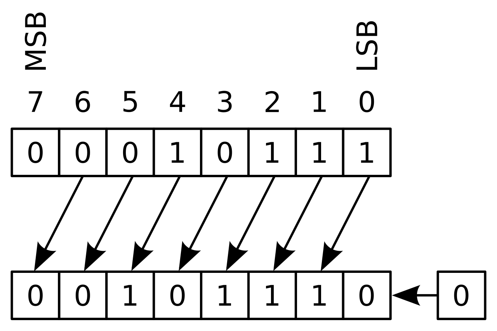
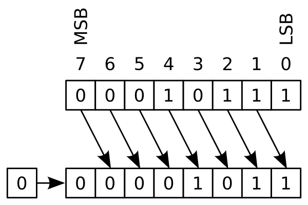

# binary operations


## understanding binary digits

A [binary number](https://en.wikipedia.org/wiki/Binary_number) is a number expressed in the binary numeral system, using only two different symbols, like 0 and 1.

To understand the binary numeral system better, let's first have a look at the more popular [decimal numeral system](https://en.wikipedia.org/wiki/Decimal):

It has 10 different symbols (0,1,2,3,4,5,6,7,8 and 9).

To write down the a number greater than 9, two or more of those symbols must be used.

For example, to write down the number thirty-six in the decimal system you write:

<pre>36</pre>

Thirty-six is a two-digit number, meaning you need two symbols to describe it. 

If reading both symbols from left to right, they form a calculation instruction:

<pre>
36 (a two-digit number)
calculate :
3 x 10 + 6 x 1 =
30 + 6 = 
36 
</pre>

The interesting part of this is that the left symbol (3) has to be calculated by 10 and the right symbol (6) has to be calculated by one, and the sum of both operations represent the number.

To write down a number greater than 99, three digits are necessary. For example, to write down the number nine-hundred-forty-two you write:


<pre>942 (a three digit number)
read from left to right :
9 x 100 + 4 x 10 + 2 x 1 = 
900 + 40 + 2 = 
942</pre>

Because the number has three digits, the first symbol needs to be multiplied by 100, the second by 10 and the third by 1. 

This decimal numeral system is also called a base-10 system.

The factors to multipy the symbols with(1,10,100,...) can be written as powers of of the base 10:

<pre>
10<sup>0</sup> =    1
10<sup>1</sup> =   10 
10<sup>2</sup> =  100
10<sup>3</sup> = 1000
and so on..
</pre>

The calculation instruction for the number 942 could also be written as:

<pre>
942:
9 x 10<sup>2</sup> + 4 x 10<sup>1</sup> + 2 x 10<sup>0</sup> =
9 x 100 + 4 x 10 + 2 x 1 =
900 + 40 + 2 = 
942
</pre>

### the binary system

The binary system has not a base of 10, but instead a base of 2:

<pre>
2<sup>0</sup> =   1
2<sup>1</sup> =   2
2<sup>2</sup> =   4
2<sup>3</sup> =   8
2<sup>4</sup> =  16
2<sup>5</sup> =  32
2<sup>6</sup> =  64
2<sup>7</sup> = 128
and so on...
</pre>

One-digit numbers in the binary system can only display the numbers 0 and 1:

to express the number zero, you write:

<pre>
0:
0 x 2<sup>0</sup> =
0 x 1 =
0
</pre>

to express the number one, you write:

<pre>
1:
1 x 2<sup>0</sup> =
1 x 1 =
1
</pre>

and for any numbe greater than 1 already more digits are necessary.

For the number two you write 10:
<pre>
10 (in binary is two in decimal):
1 x 2<sup>1</sup> + 0 x 2<sup>0</sup>=
1 x 2 + 0 x 1=
2+0=
2 (decimal)
</pre>

For the number three you write 11:

<pre>
11 ( in binary is three in decimal):
1 x 2<sup>1</sup> + 1 x 2<sup>0</sup>=
1 x 2 + 1 x 1=
2 + 1 =
3 (decimal)
</pre>

And for the number four already three digits are necessary:

<pre>
100 (in binary, is four in decimal)
1 x 2<sup>2</sup> + 0 x 2<sup>1</sup> + 0 x 2<sup>0</sup>=
1 x 4 + 0 x 2 + 0 x 1 =
4 + 0 + 0 =
4
</pre>

### binary numbers vs. decimal numbers

This table compares base-10 system versus base-2 system:

| base-10 | calculation | written | base-2 | calculation |
| --: | --: | :--: | --: | --: |
|       0 | 0x10<sup>0</sup> |  zero   |  0  | 0x2<sup>0</sup>  |
|       1 | 1x10<sup>0</sup> |  one    |  1  | 1x2<sup>0</sup>  |
|       2 | 2x10<sup>0</sup> |  two    | 10   | 1x2<sup>1</sup>+0x2<sup>0</sup>  |
|       3 | 3x10<sup>0</sup> |  three  | 11 | 1x2<sup>1</sup>+1x2<sup>0</sup> |
|       4 | 4x10<sup>0</sup> |  four   | 100 | 1x2<sup>2</sup>+0x2<sup>1</sup>+0x2<sup>0</sup> |
|       5 | 5x10<sup>0</sup> |  five   | 101 | 1x2<sup>2</sup>+0x2<sup>1</sup>+1x2<sup>0</sup> |
|       6 | 6x10<sup>0</sup> |  six    | 110 | 1x2<sup>2</sup>+1x2<sup>1</sup>+0x2<sup>0</sup> |
|       7 | 7x10<sup>0</sup> |  seven  | 111 | 1x2<sup>2</sup>+1x2<sup>1</sup>+1x2<sup>0</sup> |
|       8 | 8x10<sup>0</sup> |  eight  | 1000 | 1x2<sup>3</sup>+0x2<sup>2</sup>+0x2<sup>1</sup>+0x2<sup>0</sup> |
|       9 | 9x10<sup>0</sup> |  nine   | 1001 | 1x2<sup>3</sup>+0x2<sup>2</sup>+0x2<sup>1</sup>+1x2<sup>0</sup> |
|      10 | 1x10<sup>1</sup>+0x10<sup>0</sup> |  ten    | 1010 |  1x2<sup>3</sup>+0x2<sup>2</sup>+1x2<sup>1</sup>+0x2<sup>0</sup> |
|      11 | 1x10<sup>1</sup>+1x10<sup>0</sup> |  eleven | 1011 |  1x2<sup>3</sup>+0x2<sup>2</sup>+1x2<sup>1</sup>+1x2<sup>0</sup> |
|      12 | 1x10<sup>1</sup>+2x10<sup>0</sup> |  twelve | 1100 |  1x2<sup>3</sup>+1x2<sup>2</sup>+0x2<sup>1</sup>+0x2<sup>0</sup> |
|      13 | 1x10<sup>1</sup>+3x10<sup>0</sup> |  thirdteen | 1101 |  1x2<sup>3</sup>+1x2<sup>2</sup>+0x2<sup>1</sup>+1x2<sup>0</sup> |
|      14 | 1x10<sup>1</sup>+4x10<sup>0</sup> |  fourteen | 1110 |  1x2<sup>3</sup>+1x2<sup>2</sup>+1x2<sup>1</sup>+0x2<sup>0</sup> |
|      15 | 1x10<sup>1</sup>+5x10<sup>0</sup> |  fifteen | 1111 |  1x2<sup>3</sup>+1x2<sup>2</sup>+1x2<sup>1</sup>+1x2<sup>0</sup> |
|      16 | 1x10<sup>1</sup>+6x10<sup>0</sup> |  sixteen | 10000 | 1x2<sup>4</sup>+0x2<sup>3</sup>+0x2<sup>2</sup>+0x2<sup>1</sup>+0x2<sup>0</sup> |

### how to convert base-2 into base-10

you need to write down the base (2) to the power of (digits):


how to convert the base-2 number ```1001```into a base-10 number (```9```):

| number in base-2: | 1 | 0 | 0 | 1 |
| ---               | - | - | - | - |
| rank:        | 3 | 2 | 1 | 0 |
| =           | 2<sup>3</sup> | 2<sup>2</sup> | 2<sup>1</sup> | 2<sup>0</sup> |
| = | 8 | 4 | 2 | 1 |
| calculation:  | 8 + | 0 + | 0 + | 1= |
| result: 9 |||||

In pyhton, you can simply write a ```0b``` prefix before a number to indicate that you use a base-2 system. Python instantly converts into a base-10 number:

```python
>>>0b1001
9
```

### how to convert base-10 into base-2

You need to write down the base (2) to the power of (digits). Then you begin from left to right to set this bit (multiplying by 1) as long as the sum of all set bits (multiplied by the power of 2...) is smaller or equal the base-10 number.

how to convert a base-10 number (```37```) into a base-2 number (```100101```):

| rank: | 5 | 4 | 3 | 2 | 1 | 0 |
| -- | -- | -- | -- | -- | -- | -- |
|       | 2<sup>5</sup> | 2<sup>4</sup> |  2<sup>3</sup> | 2<sup>2</sup> | 2<sup>1</sup> | 2<sup>0</sup> |
|   | 32 | 16 | 8 | 4 | 2 | 1  |
| bit setzen: | 1 | 0 | 0 | 1 | 0 | 1 |
| 37 =       | 32+|0+|0+|4+|0+|1|
| base-2 number is: **100101** |||||||


In Python, you simply use the in-built function ```bin()``` to convert a base-10 number into a base-2 number (with an ```0b```-prefix):

```python
>>>bin(37)
'0b100101'
```

## left shift operation

_See also Wikipedia article about [Logical Shift](https://en.wikipedia.org/wiki/Logical_shift)_

A left shift operation can only be done at a binary number (base-2). Simply put, all numbers are moved to the left, and the rightmost position(s) is/are filled with a zero(s). The operator sign is a ```<<``` and you can specify how many positions to the left the numbers should be moved.

example: perform a "leftshift by 1" operation on the binary number ```1011``` (nine in base-10). The result is ```10010``` (eighteen in base-10)

python code (left_shift.py):
```python
print("in base 2:")
print(" 0b1001<<1")
print("=")
print(bin(0b1001<<1))
print()
print("in base 10:")
print(0b1001, "<<1 =", 0b1001<<1)
```
output:
```
in base 2:
 0b1001<<1
=
0b10010

in base 10:
9 <<1 = 18
```

Image below from Wikipedia article:

MSB = Most Significant Bit, LSB = Least Significant Bit

Note that bit if the Most significant bit (MSB, number 7) would have been a 1, the resulting number would have been larger, as in the example above.




<sup>Image description:  0001 0111 (decimal 23) is logically shifted by one bit to the left, the result is 0010 1110 (decimal 46).<br> Image rights: By <a href="https://en.wikipedia.org/wiki/User:Cburnett" class="extiw" title="en:User:Cburnett">en:User:Cburnett</a> - This W3C-unspecified <a href="https://en.wikipedia.org/wiki/Vector_images" class="extiw" title="w:Vector images">vector image</a> was created with <a href="https://en.wikipedia.org/wiki/Inkscape" class="extiw" title="w:Inkscape">Inkscape</a> ., <a href="http://creativecommons.org/licenses/by-sa/3.0/" title="Creative Commons Attribution-Share Alike 3.0">CC BY-SA 3.0</a>, <a href="https://commons.wikimedia.org/w/index.php?curid=1505663">Link</a></sup>


## right shift operation

_See also Wikipedia article about [Logical Shift](https://en.wikipedia.org/wiki/Logical_shift)_


The right shift operation works a bit like the left shift operation: all numbers are moved to the right, the leftmost positions is/are filled with a zero(s), and the number(s) that were at the rightmost position is simply deleted., 

The operator sign is a ```>>``` and you can specify how many positions to the right each number should be moved.

example: perform a "rightshift by 1" operation on the binary number ```1001``` (nine in base-10). The result is ```0100``` and is usually written without a leading zero as ``` 100``` (four in base-10). 

python code (right_shift.py):
```python
print("in base 2:")
print("0b1001>>1")
print("=")
print(" "+bin(0b1001>>1))
print()
print("in base 10:")
print(0b1001, ">>1 =", 0b1001>>1)
```
output:
```
in base 2:
0b1001>>1
=
 0b100

in base 10:
9 >>1 = 4
```

Image below from Wikipedia article:

MSB = Most Significant Bit, LSB = Least Significant Bit

Note that in the image below, the Least significant bit (LSB) get destroyed



<sub>Image description: 0001 0111 (decimal 23) is right shifted by one bit, the result is: 0010 1110 (decimal 46)
<br>
Image rights: By <a href="https://en.wikipedia.org/wiki/User:Cburnett" class="extiw" title="en:User:Cburnett">en:User:Cburnett</a> - This W3C-unspecified <a href="https://en.wikipedia.org/wiki/Vector_images" class="extiw" title="w:Vector images">vector image</a> was created with <a href="https://en.wikipedia.org/wiki/Inkscape" class="extiw" title="w:Inkscape">Inkscape</a> ., <a href="http://creativecommons.org/licenses/by-sa/3.0/" title="Creative Commons Attribution-Share Alike 3.0">CC BY-SA 3.0</a>, <a href="https://commons.wikimedia.org/w/index.php?curid=1505665">Link</a>
</sub>


# boolean operators

| value A | value B | result for AND | result for OR |
| :--: | :--: | :--: | :--: |
| ```True``` |  ```True``` | ```True``` | ```True``` |
| ```True``` |  ```False``` | ```False``` | ```True``` |
| ```False``` | ```True``` | ```False``` | ```True``` |
| ```False``` | ```False``` | ```False``` | ```False``` | 

## NOT 

The NOT operator yields the invert value: True becomes False and False becomes True.

| operation | result |
| -- | -- |
| ```not True``` | ```False``` |
| ```not False``` | ```True``` |

## AND

The AND operator must be placed between two boolean values. The result is True if both boolean values are True, otherwise the result is False

| value A | AND | value B | result  | 
| :--: | :--: | :--: | :--: |
| ```True``` | AND |  ```True``` | = ```True``` | 
| ```True``` | AND |  ```False``` | =```False``` | 
| ```False``` | AND | ```True``` | =```False``` | 
| ```False``` | AND | ```False``` | =```False``` |

## OR

The OR operator (it's an "inclusive OR") must be placed between two boolean values. The result is True if one or both values are True. The result is False if both values are False.

| value A | OR | value B | result  | 
| :--: | :--: | :--: | :--: |
| ```True``` | OR |  ```True``` | = ```True``` | 
| ```True``` | OR |  ```False``` | =```True``` | 
| ```False``` | OR | ```True``` | =```True``` | 
| ```False``` | OR | ```False``` | =```False``` |

## boolean operations with binary digits

boolean operations (and, or, xor, not) can not only applied to boolean values (True and False) but also directly to bits (where 1 represents True and 0 represents False). 

Python has the boolean commands ```not or and``` for boolean values but a special set of commands for binary digits:

```
~  for bitwise inversion
|  for bitwise OR
&  for bitwise AND
^  for bitwise XOR
```

### bitwise inversion

 `~` (bit-wise invert)
    - The bit-wise inversion of x is -(x+1).
    Meaning: 0b01 is added to the number and the sign is changed.


```python
print("example 1:")
print("~0b1001 = ")
print(bin(~0b1001))
print("=-(x+1)=-(0b1001 + 0b0001) = -0b1010")
print("example 2:")
print("~-0b1111 = ")
print("  "+bin(~-0b1111))
print("=-(x+1)=-(-0b1111+0b0001)=-0b1110")

```
result:
```
example 1:
~0b1001 = 
-0b1010
=-(x+1)=-(0b1001 + 0b0001) = -0b1010
example 2:
~-0b1111 = 
  0b1110
=-(x+1)=-(-0b1111+0b0001)=-0b1110
```

### bitwise and

- `&` (bit-wise AND)
    - Bit-wise AND of the numbers: if both bits are `1`, the result is `1`. Otherwise, it's `0`.

| example A | example B | example C | 
| :--: | :--: | :--: |
| 0b1100 | 0b1111 | 0b1011 |
| & | & | & |
| 0b0101 | 0b0000 | 0b0001 |
| = | = | = |
| 0b0100 | 0b0000 | 0b0001 |


## bitwise or (inclusive OR)

- `|` (bit-wise OR)
    - Bitwise OR of the numbers: if both bits are `0`, the result is `0`. Otherwise, it's `1`. 
    
| example A | example B | example C | 
| :--: | :--: | :--: |
| 0b1100 | 0b1111 | 0b1011 |
| \| | \| | \| |
| 0b0101 | 0b0000 | 0b0001 |
| = | = | = |
| 0b1101 | 0b1111 | 0b1011 |

## bitwise xor (exclusive OR)

- `^` (bit-wise XOR) 
    - Bitwise XOR of the numbers: if both bits (`1 or 0`) are the same, the result is `0`. Otherwise, it's `1`.

| example A | example B | example C | 
| :--: | :--: | :--: |
| 0b1100 | 0b1111 | 0b1011 |
| ^ | ^ | ^ |
| 0b0101 | 0b0000 | 0b0001 |
| = | = | = |
| 0b1001 | 0b1111 | 0b1010 |


