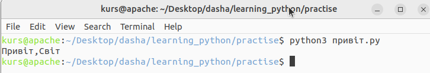

# Перші кроки

Давайте подивимося, як створити традиційну програму «Привіт, Світ!» на Python. Це навчить вас писати, зберігати та запускати програми на Python.

Є два способи використання Python для запуску вашої програми - використання інтерактивного командного рядка інтерпретатора та використання файлу з текстом програми. Ми розглянемо обидва ці методи.

## Використання командного рядка інтерпретатора 
{w=40px}{bdg-secondary-line}`англійська:` _Using The Interpreter Prompt_

Запустіть інтерпретатор Python, ввівши команду `python3`та натиснувши клавішу`[Enter]`.

Щойно ви запустите Python, ви побачите `>>>`, де ви можете почати вводити текст.Це називається _командний рядок інтерпретатора Python_(англ."_Python interpreter prompt_").

У командному рядку інтерпретатора Python введіть:

::::{admonition} код python
```python
print("Привіт, Світ!")
```

після чого натиснить клавішу `[Enter]`. Ви повинні побачити на екрані слова  `Привіт, Світ!`.

**Приклад**: 
```
$ python3
Python 3.6.0 (default, Jan 12 2017, 11:26:36)
[GCC 4.2.1 Compatible Apple LLVM 8.0.0 (clang-800.0.38)] on darwin
Type "help", "copyright", "credits" or "license" for more information.
>>> print("Привіт, Світ!")
Привіт, Світ!
``` 
::::

Це приклад того, що ви повинні бачити під час використання комп’ютера Mac OS X. Інформація о версії програмного забезпечення Python  може відрізнятися в наступних рядках:

```
Python 3.6.0 (default, Jan 12 2017, 11:26:36)
[GCC 4.2.1 Compatible Apple LLVM 8.0.0 (clang-800.0.38)] on darwin
```
залежно від вашого комп’ютера, але частина командного рядка (тобто від `>>>` і далі) має бути однаковою незалежно від операційної системи:
```
Type "help", "copyright", "credits" or "license" for more information.
>>> print("Привіт, Світ!")
Привіт, Світ!
```

Зауважте, що Python миттєво дає вам результат рядка! Те, що ви щойно ввели, є одиночним _оператором_ Python. Ми використовуємо `print`, щоб (як це не дивно) надрукувати будь-яке значення, яке ви йому надаєте. Тут ми надаємо текст «Привіт, Світ!», і він негайно друкується на екрані.

### Як вийти з командного рядка інтерпретатора
{w=40px}{bdg-secondary-line}`англійська:` _How to Quit the Interpreter Prompt_

Якщо ви використовуєте оболонку GNU/Linux або OS X, ви можете вийти з _Python interpreter prompt_, натиснувши `[ctrl + d]` або ввівши `exit()`(примітка: не забудьте включити дужки, `()`) ,а потім натиснути клавіші `[Enter]`.

Якщо ви використовуєте _Python interpreter prompt_ Windows, натисніть `[ctrl + z]`, а потім клавішу `[Enter]`.

## Вибір редактора  
{w=40px}{bdg-secondary-line}`англійська:` _Choosing An Editor_

Оскільки ми не можемо набирати програму в _Python interpreter prompt_ щоразу, коли нам потрібно щось запустити, нам доведеться зберігати програми у файлах, щоб потім мати можливість запускати їх скільки завгодно разів.

Перш ніж приступити до написання програм на Python у файлах, нам потрібний редактор для роботи із файлами програм. Вибір редактора дуже важливий. Підходити до вибору редактора треба так само, як і до вибору особистого автомобіля. Хороший редактор допоможе вам легко писати програми на Python, роблячи вашу подорож більш комфортною, а також дозволяючи швидше та безпечніше досягти вашої мети.

Одна з основних вимог є _підсвічування синтаксису_, коли різні елементи програми на Python забарвлені, щоб ви могли легко _бачити_ вашу програму та хід виконання.

Якщо ви не знаєте, з чого почати, я б порекомендував використовувати програмне забезпечення [PyCharm Educational Edition](https://www.jetbrains.com/pycharm-edu/), яке доступне для Windows, Mac OS X і GNU/Linux. Подробиці в наступному розділі.

Якщо ви використовуєте Windows, *не використовуйте Блокнот* - це поганий вибір, оскільки в нього не має функції підсвічування синтаксису,а також  він не дозволяє вставляти відступи, що дуже важливо у нашому випадку, як ми побачимо пізніше. Хороші редактори зроблять це автоматично.

Якщо ви досвідчений програміст, ви повинні вже використовувати [Vim](http://www.vim.org) або [Emacs](http://www.gnu.org/software/emacs/). Зайве говорити, що це два найпотужніші редактори, і ви отримаєте користь від їх використання для написання своїх програм на Python. Я особисто використовую обидва для більшості своїх програм і навіть написав [цілу книгу про Vim](https://vim.swaroopch.com/).

Якщо ви готові витратити час на вивчення Vim або Emacs, я настійно рекомендую вам навчитися використовувати будь-який з них, оскільки це буде дуже корисно для вас у довгостроковій перспективі. Однак, як я вже згадував раніше, початківці можуть почати з PyCharm і зосередити навчання на Python, а не на редакторі на даний момент.

Повторюю, будь ласка, виберіть відповідний редактор - це може зробити написання програм Python веселішим і легшим.

Якщо ви зацікавлені в детальному обговоренні цієї теми, перегляньте [Пошук ідеального редактора коду Python](https://realpython.com/courses/finding-perfect-python-code-editor/).

## PyCharm

PyCharm (Community Edition) це безкоштовний редактор, спеціально розроблений для написання програм на Python. Щоб завантажити PyCharm, [дотримуйтесь інструкцій на](https://www.jetbrains.com/pycharm/download/)  

Зверніть увагу, що PyCharm також пропонує професійну версію редактора з більшими можливостями, однак ця версія не є безкоштовною.

## Visual Studio code

Visual Studio Code — безкоштовний редактор коду, який можна використовувати для написання програм на Python.

1.Завантажте та встановіть Visual Studio Code з  <https://code.visualstudio.com/>

2.Коли ви пишете свою першу програму на Python з Visual Studio code, як наприклад, 'print("Привіт,Світ")' і запускаєте її, Visual Studio Code автоматично завантажить і встановить розширення для мови Python. Як тільки цей плагін буде встановлено, ви готові.

Дивіться більше інформації про те, як використовувати код Visual Studio з python тут:

* <https://code.visualstudio.com/docs/languages/python>


## Vim

Vim є відомим безкоштовним текстовим редактором, який можна використовувати для написання програм на Python.

1.Завантажте та встановіть Vim з офіційної домашньої сторінки:  <http://www.vim.org>

2.Перегляньте статті про те, як адаптувати Vim для використання з програмами Python у вашій операційній системі, наприклад:

* https://realpython.com/vim-and-python-a-match-made-in-heaven/
* https://rapphil.github.io/vim-python-ide/
 
## Emacs

Emacs є дуже відомим безкоштовним текстовим редактором, який можна використовувати майже для всього, включно з написанням програм на Python.

1. Завантажте та встановіть Emacs <http://www.gnu.org/software/emacs/>
2. Перегляньте статті про те, як адаптувати Emacs для написання програм на Python у вашій операційній системі, наприклад:

* https://realpython.com/emacs-the-best-python-editor/
* https://www.emacswiki.org/emacs/PythonProgrammingInEmacs


## Iнші редактори
{w=40px}{bdg-secondary-line}`англійська:` _Other editors_

Існує багато інших редакторів для написання коду на Python, більшість із яких є безкоштовним програмним забезпеченням. Кожен із них має свої особливі переваги та недоліки. Виберіть на свій смак, що найкраще підходить саме для вас.

Список редакторів Pytho можна знайти тут:

* https://wiki.python.org/moin/PythonEditors


## Без використання редактора - робота безпосередньо з вихідними файлами 
{w=40px}{bdg-secondary-line}`англійська:` _Using no editor - working directly with source files_

Вам не потрібен спеціальний редактор для написання програм на Python, ви можете використовувати будь-який редактор, якщо збережете свою програму на Python як текстовий файл із правильним розширенням файлу ".py". 

Наприклад, напишіть цю програму та збережіть її як "привіт.py":
```
print("Привіт,Cвіт")
```

Більшість редакторів Python пропонують кнопку «Пуск» або «Виконати», на якій можна натиснути, щоб запустити програму. Однак, якщо у вас є  відкритий термінал у тій же папці, де збережена і ваша програма `привіт.py`, і вона збережена правильно, ви можете просто ввести в терміналі:

```
python3 привіт.py

````
щоб запустити програму.

Це припускає, що ви трохи знаєте про роботу термінала і що ви зберегли програму привіт.py у тому самому місці, де ви відкривали термінал.


 
