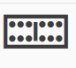

# Введення-виведення
{w=40px}{bdg-secondary-line}`англійська:` _Input and Output_ 

Будуть ситуації, коли ваша програма повинна взаємодіяти з користувачем. Наприклад, ви хотіли б прийняти дані від користувача, а потім надрукувати деякі результати. Ми можемо досягти цього за допомогою функції `input()` і функції `print` відповідно.

Для виведення ми також можемо використовувати різні методи класу `str` (рядок). Наприклад, ви можете використати метод `rjust`, щоб отримати рядок, вирівняний по правому краю до зазначеної ширини. Дивіться `help(str)` для отримання додаткової інформації.

Іншим поширеним типом введення/виведення є робота з файлами. Можливість створювати, читати та записувати файли є важливою для багатьох програм, і ми дослідимо цей аспект у цій главі.

## Введення від користувача
{w=40px}{bdg-secondary-line}`англійська:` _Input from user_


::::{admonition} код python [io_input_ukr.py](programs/io_input_ukr.py)
:::{literalinclude} programs/io_input_ukr.py
:::
**Висновок** (3 рази):
:::{literalinclude} programs/io_input_ukr.txt
:::
::::

**Як це працює**

Ми використовуємо функцію зріз, щоб перевернути текст. Ми вже бачили, як можна зробити [зрізи послідовностей,slices from sequences](./data_structures_ukr.md#sequence) за допомогою коду `seq[a:b]`, починаючи з позиції `a` до позиції `b`. Ми також можемо надати третій аргумент, який визначає _крок_ (англ."_step_"), за яким виконується зріз. Крок за замовчуванням дорівнює `1`, через що він повертає безперервну частину тексту. Введення від’ємного кроку, тобто `-1`, поверне текст у зворотному порядку.

Функція `input()` приймає рядок як аргумент і відображає його користувачеві. Потім вона чекає, поки користувач щось введе та натисне клавішу введення. Коли користувач введе та натисне клавішу введення, функція `input()` поверне текст, який ввів користувач.

Ми беремо цей текст і перевертаємо його. Якщо вихідний текст і реверсований текст рівні, тоді текст є [паліндромом](http://en.wiktionary.org/wiki/palindrome).

### Домашнє завдання

Перевірка того, чи є текст паліндромом, також має ігнорувати пунктуацію, пробіли та регістр літер. Наприклад, «Далі буде дуб і лад», також є паліндромом,але наша поточна програма так не вважає.Чи можете ви вдосконалити наведену вище програму, щоб  програма розпізнала цей паліндром?

### Підказка:

Скористайтеся кортежем (список усіх символів пунктуації можна знайти [тут](http://grammar.ccc.commnet.edu/grammar/marks/marks.htm)), що містять усі заборонені символи, та застосуйте тест на приналежність, щоб виявити символи, що підлягають видаленню, тобто forbidden = („!“, „?“, „.“, ...).

### Варіант вирешення:

```python
# покращена версія, буде ігнорувати всі
# знаки пунктуації, такі як пробіли, крапки, коми тощо.

ігнорувати_рядок = " .,;:!?"

def чистий_текст(чернетка):
	чистий = ""
	for x in чернетка:
		if x not in ігнорувати_рядок:
			чистий += x
	return чистий


def reverse(текст):
    return текст[::-1]


def є_паліндром(текст):
    return текст.lower() == reverse(текст).lower()

# "Далі буде дуб і лад"
щось = input("Введіть текст:")
if є_паліндром(чистий_текст(щось)):
    print("Так, це паліндром")
else:
    print("Ні, це не паліндром")
```

## Файли

Ви можете відкривати та використовувати файли для читання або запису, створивши об’єкт класу `file` ,а читати/записувати у файл - використовуючи його методи `read`, `readline` або `write` відповідно. Можливість читання або запису у файл залежить від режиму, який ви вказали для відкриття файлу. Після роботи з файлом, потрібно викликати метод `close`, щоб повідомити Python, що ми закінчили використовувати файл.

::::{admonition} код python [io_using_file_ukr.py](programs/io_using_file_ukr.py)
:::{literalinclude} programs/io_using_file_ukr.py
:::
**Висновок**:
:::{literalinclude} programs/io_using_file_ukr.txt
:::
::::

**Як це працює**

Зауважте, що ми можемо створити новий файловий об’єкт просто за допомогою методу `open`. Ми відкриваємо цей файл (або створюємо його, якщо він ще не існує) за допомогою вбудованої функції `open` і вказуємо назву файлу та режим, у якому ми хочемо відкрити файл. Режим може бути режимом читання (`'r'`), режимом запису (`'w'`) або режимом додавання (`'a'`). Ми також можемо вказати, чи ми читаємо, записуємо або додаємо дані: в текстовому режимі (`'t'`) чи двійковому (бінарному) режимі (`'b'`). Насправді існує набагато більше доступних режимів, і `help (open)` надасть вам більше інформації про них. За замовчуванням `open()` вважає файл текстовим файлом і відкриває його в режимі читання.

У нашому прикладі ми спочатку відкриваємо/створюємо файл у режимі запису тексту та використовуємо метод `write` файлового об'єкта, щоб записати нашу рядкову змінну `вірш` у файл, а потім ми закриваємо файл за допомогою `close`.

Далі знову відкриваємо цей же файл для читання. Нам не потрібно вказувати режим, оскільки «читати текстовий файл» є режимом за замовчуванням. Ми читаємо кожен рядок файлу за допомогою методу `readline` у циклі. Цей метод повертає повний рядок, включаючи символ нового рядка в кінці рядка. Коли повертається _порожній_ рядок, це означає, що ми перериваємо цикл за допомогою break.

Зрештою, ми остаточно закриваємо файл за домопогою `close`.

Ми бачимо з наших результатів `readline`, що ця програма справді записувала та читала наш новий файл `вірш.txt`.

## Pickle

Python надає стандартний модуль під назвою `pickle`(рickle-англ."маринувати","солити"), який можна використовувати для зберігання _будь-якого_ простого об’єкта Python у файлі, а потім отримати його назад. Це називається *тривалим* (англ."*persistently*") збереженням об’єкта.


::::{admonition} код python [io_pickle_ukr.py](programs/io_pickle_ukr.py)
:::{literalinclude} programs/io_pickle_ukr.py
:::
**Висновок**:
:::{literalinclude} programs/io_pickle_ukr.txt
:::
::::


**Як це працює**

Щоб зберегти об’єкт у файлі, ми маємо спочатку відкрити файл за допомогою `open`  в режимі бінарного запису ('wb'), а потім викликати функцію `dump` із  модуля `pickle`. Цей процес називається _консервацією_(англ."_pickling_").

Далі ми отримуємо об’єкт за допомогою функції `load` із  модуля `pickle`, яка повертає об’єкт. Цей процес називається "розконсервацією"(англ."_unpickling_").

## Unicode

Досі, коли ми писали та використовували рядки або читали та записували у файл, ми використовували лише прості англійські символи. Як англійські, так і неанглійські символи можуть бути представлені в Unicode (будь ласка, перегляньте статті в кінці цього розділу для отримання додаткової інформації), а Python 3 за замовчуванням зберігає рядкові змінні (подумайте про весь той текст, який ми написали, використовуючи одиничні, подвійні або потрійні лапки) в Unicode.

:::{note}
Якщо ви використовуєте Python 2, і ми хочемо мати можливість читати та писати іншими мовами, відмінними від англійської, нам потрібно використовувати тип `unicode`, і все починається з символу `u`, напр. `u"Привіт, Світ!"`
:::

```python
>>> "Привіт, Світ!"
'Привіт, Світ!'
>>> type("Привіт, Світ!")
<class 'str'>
>>> u"Привіт, Світ!"
'Привіт, Світ!'
>>> type(u"Привіт, Світ!")
<class 'str'>
```

Коли дані надсилаються через Інтернет, нам потрібно надсилати їх у байтах... те, що ваш комп’ютер легко розуміє. Правила перекладу Unicode (це те, що Python використовує, коли зберігає рядок) у байти, називаються encoding (encoding- англ."кодування","шифрування"). Популярним encoding є UTF-8. Ми можемо читати та писати в UTF-8, використовуючи простий ключовий аргумент у нашій функції `open`.

::::{admonition} код python [io_unicode_ukr.py](programs/io_unicode_ukr.py)
:::{literalinclude} programs/io_unicode_ukr.py
:::
::::

**Як це працює**

Ми використовуємо `io.open`, а потім використовуємо аргумент `encoding` у першому рядку коду (in the first open statement) для кодування повідомлення, а потім знову в другому рядку коду open під час декодування повідомлення. Зауважте, що ми повинні використовувати кодування лише в рядку коду open у текстовому режимі.


Кожного разу, коли ми пишемо програму, яка використовує літерали Unicode (ставляючи `u` перед рядком), як ми використовували вище, ми повинні переконатися, що самому Python повідомляється, що наша програма використовує UTF-8, і ми повинні поставити ` # encoding=utf-8` коментар у верхній частині нашої програми.
 

Ви повинні дізнатися більше про цю тему, прочитавши:

- ["Абсолютний мінімум, який кожен розробник програмного забезпечення має знати про Unicode та набори символів", англ."The Absolute Minimum Every Software Developer Absolutely, Positively Must Know About Unicode and Character Sets"](http://www.joelonsoftware.com/articles/Unicode.html)
- [Python Unicode Howto](http://docs.python.org/3/howto/unicode.html)
- [Pragmatic Unicode talk by Nat Batchelder](http://nedbatchelder.com/text/unipain.html)

Від перекладача:

Як працювати з unicode:
1.знайдіть перелік символів у wiki: https://en.wikipedia.org/wiki/List_of_Unicode_characters ;
2.знайдіть один знак (наприклад: надрукувати парасольку),
у вікіпедії сказано, що юнікод: U+2602;
3.якщо unicode містить 4 цифри або менше: 
 print("\u2602")


4.у випадку друку знака плитки доміно 6, unicode - U+1F061
5.даний Юнікод містить більше 4 цифр:
заповнити  рядок початковими нулями, поки не буде 8 цифр:
print("\U0001F061")




## Резюме

Ми обговорили різні типи введення-виведення, обробку файлів, модуль pickle і Unicode.

Далі ми розглянемо концепцію винятків.


