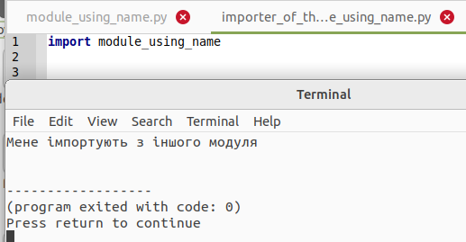
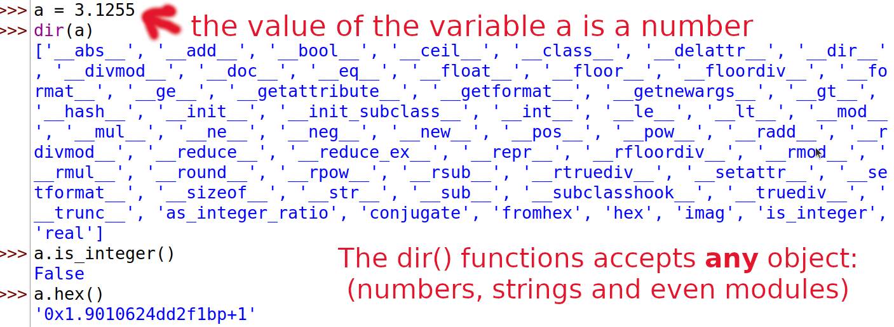
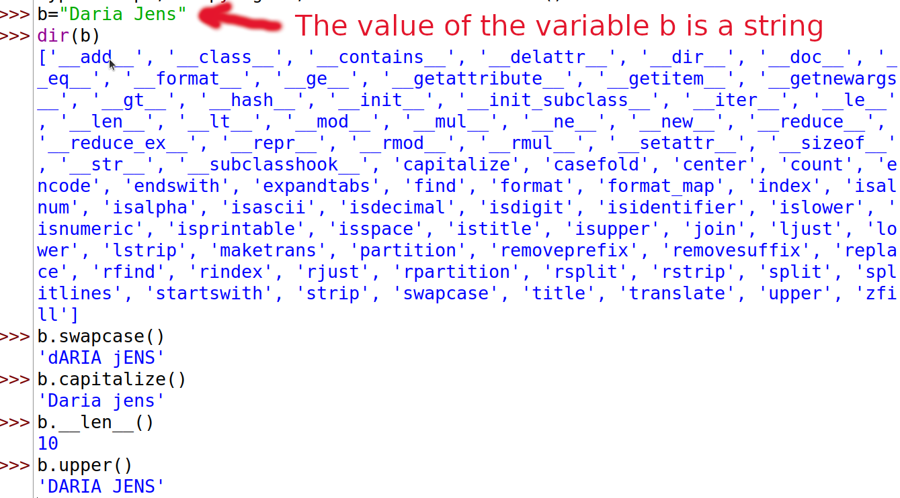
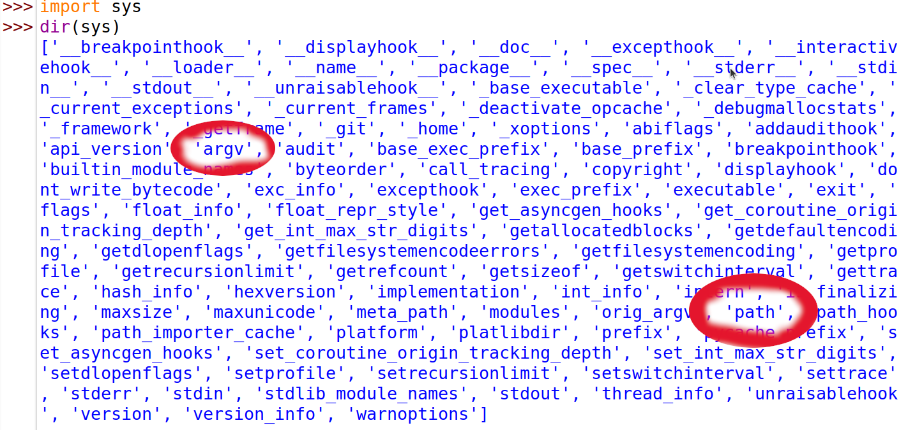

# Модулі
{w=40px}{bdg-secondary-line}`англійська:` _Modules_

Ви вже бачили, як можна повторно використовувати код у своїй програмі, визначивши функції один раз. Що, якби ви хотіли повторно використати кілька функцій в інших програмах, які ви пишете? Як ви вже, напевно,здогадалися, відповідь — модулі.

Існують різні методи написання модулів, але найпростішим способом є створення файлу з розширенням `.py`, який містить функції та змінні.

Іншим методом є написання модулів тією мовою, якою був написаний сам інтерпретатор Python. Наприклад, ви можете писати модулі  [мовою програмування C](http://docs.python.org/3/extending/) ,які після компіляції можуть використовуватись стандартним інтерпретатором Python.

Модуль може бути  *імпортований* в іншу програму, щоб програма використовувала функції з модуля. Таким чином ми також можемо використовувати стандартну бібліотеку Python. Спочатку ми розглянемо, як використовувати модулі стандартної бібліотеки.

Приклад (зберегти як `module_using_sys.py`):


::::{admonition} код python [module_using_sys_ukr.py](programs/module_using_sys_ukr.py)
:::{literalinclude} programs/module_using_sys_ukr.py
:::
**Висновок**: 
:::{literalinclude} programs/module_using_sys_ukr.txt
:::
::::


**Як це працює**

Спочатку ми  *імпортуємо* модуль `sys` за допомогою команди `import`. По суті, це означає, що ми повідомляємо Python про використання цього модуля. Модуль `sys` містить функції, які стосуються інтерпретатора Python та його середовища, тобто системи (system). 

Коли Python виконує команду `import sys`, він шукає модуль `sys`. У цьому випадку це один із вбудованих модулів, і, отже, Python знає, де його знайти.

Якби це не був скомпільований модуль, тобто модуль, написаний мовою Python,тоді інтерпретатор Python шукав би його у папках , указаних у змінній `sys.path`. Якщо модуль знайдено, команди в тілі цього модуля виконуються, і модуль стає *доступним* для використання. Зауважте, що ініціалізація (ряд дій, які проводяться при початковому завантаженні) виконується при *першому* імпорті модуля.

Доступ до змінної `argv` в модулі `sys` здійснюється за допомогою крапкової нотації (крапки), тобто `sys.argv`. Це чітко вказує на те, що це ім'я є частиною модуля `sys`. Ще одна перевага цього підходу полягає в тому, що ім'я не суперечить жодній змінній `argv`, яка використовується у вашій програмі.

Змінна `sys.argv` — це *список* рядків  (списки докладно пояснюються в [пізнішій главі](./data_structures_ukr.md#data-structures)). Зокрема, `sys.argv` містить список *аргументів командного рядка* (англ."*command line arguments*"),тобто аргументів, переданих програмі з командного рядка.

Якщо ви використовуєте середовище розробки( англ.IDE, "Integrated Development Environment") для написання та запуску цих програм, пошукайте десь у її меню можливість передавати параметри командного рядка.

У нашому прикладі, коли ми виконуємо `python module_using_sys.py ми є аргументами`, ми запускаємо модуль  `module_using_sys.py`  командою `python`,а все інше, що слідуює далі, - є аргументами, які передаються програмі. Python зберігає аргументи командного рядка у змінній `sys.argv` для подальшого використання.

Пам’ятайте, ім’я запущеного сценарія (програму на інтерпретованій мові програмування також називають сценарієм або скриптом) завжди є першим аргументом у списку `sys.argv`. Отже, у цьому випадку ми матимемо  `'module_using_sys.py'` як `sys.argv[0]`, `'ми'` як `sys.argv[1]`, `'є'` як `sys.argv[2]` та `'аргументами'` як `sys.argv[3]`. Зверніть увагу, що Python починає відлік з 0, а не з 1.

`sys.path`- це список шляхів (англ." list of paths"), з яких імпортуються модулі. Зверніть увагу, що перший рядок у `sys.path` порожній - цей порожній рядок вказує на те, що поточна папка також є частиною `sys.path`. Це означає, що ви можете безпосередньо імпортувати модулі, розташовані в поточній папці. Якщо цього не буде, то вам доведеться розмістити свій модуль в одній із папок, указаних у `sys.path`.

Зверніть увагу, що поточна папка - це папка, з якої запускається програма. Запустіть `import os; print(os.getcwd())`, щоб дізнатися поточну папку вашої програми.

:::{figure} img/screenshot_getcwd.png
:figwidth: 100%

<small>Screenshot: Get current work directory</small>
:::

## Байт-компільовані.pyc файли
{w=40px}{bdg-secondary-line}`англійська:` _Byte-compiled.pyc files_

Імпортування модуля є відносно дорогою справою, тому Python робить деякі хитрощі, щоб зробити це швидше. Одним із способів -створити *байт-скомпільовані*  файли (або байткод) з розширенням `.pyc`, яке є проміжною формою, у яку Python перетворює програму (пам’ятаєте [вступний розділ](./about_python_ukr.md#interpreted) про те, як працює Python? ). Цей файл `.pyc` корисний при імпорті модуля наступного разу в іншу програму - це буде набагато швидше, оскільки частину обробки, необхідної для імпортування модуля, уже виконано. Крім того, ці скомпільовані файли не залежать від платформи.

ПРИМІТКА. Зазвичай, файли `.pyc` створюються в тій ж самій папці, де розташовані і відповідні файли `.py`. Якщо Python не може отримати доступ до запису файлів у цій папці, файли `.pyc` _не_ створюватимуться.

## Оператор  from..import
{w=40px}{bdg-secondary-line}`англійська:` _The from..import statement_

Якщо ви хочете безпосередньо імпортувати змінну `argv` у свою програму (і не вводити для неї `sys.` при зверненні до неї, щоразу), ви можете використати оператор `from sys import argv`.

:::{note}
загалом *уникайте* використання оператора `from..import`, використовуйте замість нього оператор `import`. Це пояснюється тим, що ваша програма уникатиме зіткнень імен і буде більш читабельною.
:::


::::{admonition} код python [import_from1_ukr.py](programs/import_from1_ukr.py)
:::{literalinclude} programs/import_from1_ukr.py 
:::
**Висновок**:
:::{literalinclude} programs/import_from1_ukr.txt
:::
::::

::::{admonition} код python [import_from2_ukr.py](programs/import_from2_ukr.py)
:::{literalinclude} programs/import_from2_ukr.py
:::
**Висновок**:
:::{literalinclude} programs/import_from2_ukr.txt
:::
::::


## Ім'я модуля - `__name__`
{w=40px}{bdg-secondary-line}`англійська:` _A module's `__name__`_

Кожен модуль має ім’я. Існують команди Рython, за допомогою яких можно дізнатися назву фактичного модуля Рython.
Це зручно, щоб з’ясувати, чи працює модуль окремо чи імпортується. Як згадувалося раніше, коли модуль імпортується вперше, код, який він містить, виконується. Ми можемо використовувати це, щоб змусити модуль поводитись по-різному, залежно від того, чи використовується він сам по собі, чи імпортується з іншої програми. Цього можна досягти за допомогою атрибута `__name__` модуля.

::::{admonition} код python [module_using_name_ukr.py](programs/module_using_name_ukr.py)
:::{literalinclude} programs/module_using_name_ukr.py
:::
**Висновок**: 
:::{literalinclude} programs/module_using_name_ukr.txt
:::
::::

Якщо невелику програму вище запустити безпосередньо, ви побачите результат, як описано вище.
Однак, якщо маленьку програму вище імпортовано з іншої програми, ви побачите наступний результат:

```python
import module_using_name_ukr
```
Висновок:



**Як це працює**

Кожен модуль Python має своє ім´я `__name__`. Якщо воно дорівнює `'__main__'`, це означає, що модуль запущений самостійно користувачем, і ми можемо вжити відповідних дій.

## Створення власних модулів

Створювати власні модулі легко, ви робити це весь час! Це тому, що кожна програма Python також є модулем. Вам просто потрібно переконатися, що вона має розширення `.py`. Наступний приклад повинен прояснити це.

::::{admonition} код python [my_module_ukr.py](programs/my_module_ukr.py)
:::{literalinclude} programs/my_module_ukr.py
:::
::::

Вище був зразок *модуля*. Як бачите, у ній немає нічого особливого порівняно з нашою звичайною програмою на Python. Далі ми побачимо, як використовувати цей модуль в інших наших програмах на Python.

Пам’ятайте, що модуль слід розмістити або в тій самій папці, що й програма, з якої ми його імпортуємо, або в одній з папок, указаних у `sys.path`.

::::{admonition} код python [mymodule_demo_ukr.py](programs/mymodule_demo_ukr.py)
:::{literalinclude} programs/mymodule_demo_ukr.py
:::
**Висновок**
:::{literalinclude} programs/mymodule_demo_ukr.txt
:::
::::

**Як це працює**

Зверніть увагу, що для доступу до елементів модуля ми використовуємо ту саму нотацію з крапкою. Python добре використовує ту саму нотацію, щоб надати їй характерного відчуття «Pythonic», щоб нам не довелося вивчати нові способи виконання завдань.

Ось версія, яка використовує синтаксис  `from..import` (зберегти як`mymodule_demo2_ukr.py`):


::::{admonition} код python [mymodule_demo2_ukr.py](programs/mymodule_demo2_ukr.py)
:::{literalinclude} programs/mymodule_demo2_ukr.py
:::
::::

Висновок `mymodule_demo2_ukr.py` такий самий, як і висновок `mymodule_demo_ukr.py`.

Зауважте, що якби ім’я `__version__` вже було оголошено в модулі, який імпортує mymodule, виникне зіткнення. Це також ймовірно, тому що це звичайна практика для кожного модуля оголошувати номер своєї версії за допомогою цієї назви. Тому, завжди рекомендується віддавати перевагу оператору `import`, навіть якщо це може зробити вашу програму трохи довшою.

Ви також можете використовувати:

```python
from mymodule import *
```

Це імпортує всі загальнодоступні назви, такі як `скажи_привіт`, але не імпортує `__version__`, оскільки воно починається з подвійного підкреслення.

:::{warning}
пам’ятайте, що вам слід уникати використання import-star, тобто `from mymodule import *`.
:::


:::{admonition} Дзен of Python
:class: hint
Один із керівних принципів Python полягає в тому, що «Явне краще за неявне». Запустіть `import this` в Python, щоб дізнатися більше.
:::

## Функція `dir`
{w=40px}{bdg-secondary-line}`англійська:` _The `dir` function_ 

Вбудована функція `dir()` повертає список імен, визначених об’єктом.
Якщо об’єкт є модулем, цей список включає функції, класи та змінні, визначені в цьому модулі.

Ця функція може приймати аргументи.
Якщо аргументом є назва модуля, функція повертає список імен цього зазначеного модуля.
Якщо аргументу немає, функція повертає список імен з поточного модуля.

приклад:

```
$ python
>>> import sys

# отримаємо список атрибутів модуля
>>> dir(sys)
['__displayhook__', '__doc__',
'argv', 'builtin_module_names',
'version', 'version_info']
# тут показано лише кілька записів

# отримати список атрибутів для поточного модуля
>>> dir()
['__builtins__', '__doc__',
'__name__', '__package__', 'sys']

# створити нову змінну 'a'
>>> a = 5

>>> dir()
['__builtins__', '__doc__', '__name__', '__package__', 'sys', 'a']

# видалити/видалити ім’я
>>> del a

>>> dir()
['__builtins__', '__doc__', '__name__', '__package__', 'sys']
```

**Як це працює**

По-перше, ми бачимо використання `dir` к імпортованому модулі `sys`. Ми бачимо величезний список атрибутів, які він містить.

Далі ми викликаємо функцію `dir` без передачі їй параметрів. За замовчуванням вона повертає список атрибутів для поточного модуля. Зверніть увагу, що список імпортованих модулів також є частиною цього списку.

Щоб спостерігати за дією `dir`, ми визначаємо нову змінну `a` і призначаємо їй значення, а потім знову викливаємо `dir`. Бачимо, що в списку з такою ж назвою є додаткове значення. Ми видаляємо змінну/атрибут поточного модуля за допомогою оператора del, та зміни
знову відобразяться на виведенні функції `dir`.

Примітка щодо `del`: цей оператор використовується для *видалення* змінної/назви, і після його виконання, у нашому випадку `del a`, ви більше не можете отримати доступ до змінної `a` -  ніби вона раніше взагалі ніколи не існувала.

Зверніть увагу, що функція `dir()` працює з *будь-яким* об'єктом. Наприклад, запустіть `dir(str)` для атрибутів класу `str` (рядок).

Існує також функція [`vars()`](http://docs.python.org/3/library/functions.html#vars), яка потенційно може надати вам атрибути та їхні значення, але вона не працюватиме для всіх випадків.

## Пакети
{w=40px}{bdg-secondary-line}`англійська:` _Packages_

На даний момент ви, мабуть, почали дотримуватись ієрархії організації ваших програм. Змінні зазвичай знаходяться всередині функцій. Функції та глобальні змінні зазвичай знаходяться всередині модулів. Що, якби ви хотіли організувати модулі? Ось тут і з’являються пакети.

Пакети — це просто папки модулів зі спеціальним файлом `__init__.py`, який вказує Python, що ця папка особлива, оскільки містить модулі Python.

Припустімо, ви хочете створити пакет під назвою «світ» із підпакетами «азія», «африка» тощо, а ці підпакети, у свою чергу, містять такі модулі, як «індія», «мадагаскар» тощо.

Ось як ви структуруєте папки:

```
- <деяка папка, наявна в sys.path>/
    - світ/
        - __init__.py
        - азія/
            - __init__.py
            - індія/
                - __init__.py
                - foo.py
        - африкa/
            - __init__.py
            - мадагаскар/
                - __init__.py
                - bar.py
```

Пакети – це просто зручність для ієрархічної організації модулів. Ви побачите багато прикладів цього в [стандартній бібліотеці](./stdlib_ukr.md#stdlib).

## Резюме

Подібно до того, як функції є багаторазовими частинами програм, модулі є багаторазовими програмами. Пакети — це ще одна ієрархія для організації модулів. Стандартна бібліотека Python є прикладом такого набору пакетів і модулів.

Ми побачили, як використовувати ці модулі та створювати власні модулі.

Далі ми дізнаємося про деякі цікаві концепції, які називаються структурами даних.


## -- Доповнення від перекладача --

## Модулі

::::{admonition} код python [dicethrow_ukr.py](programs/dicethrow_ukr.py)
:::{literalinclude} programs/dicethrow_ukr.py
:::
**Висновок** (ваш висновок може бути іншим!):
:::{literalinclude} programs/dicethrow_ukr.txt
:::
::::

**Як це працює**

По-перше, наведена вище програма Рython *імпортує* модуль "random" зі стандартної бібліотеки Рython.  Стандартна бібліотека  Рython — це величезна колекція модулів Рython, яка автоматично встановлюється, якщо ви інсталюєте  Рython на своєму комп’ютері. Перегляньте <https://docs.python.org/3/library/index.html> для повного списку модулів.

Кожен із цих модулів стандартної бібліотеки Python має декілька функцій. 

Щоб скористатися однією з цих функцій, необхідно використовувати "крапкову нотацію": написати ім’я модуля, потім крапку, а потім назву функції.

У наведеному вище прикладі функція _randint_ модуля _random_ викликається за допомогою:

```python
random.randint(1,6)
```

Два параметри в дужках (1,6) вказують на те, що функція _randint_ має створювати випадкове ціле число від 1 до 6 (подібно до кидання шестигранного кубика).


У прикладах від Swaroop використовуються поняття  "PythonPath" і Змінні середовища (англ."Еnviroment variables")

Оскільки не всі знають ці концепції, ось коротке пояснення (може бути корисним наступний сайт https://cpto.dp.ua/public_html/posibnyky/OSWin10/03/3_2.htm):

* У комп'ютерній термінології _каталог_, _директорія_(англ."directory") чи _тека_, _папка_ (англ."folder") - це фізичне місце, де можна зберігати файли на комп’ютері. Такі файли, як програми на Python або сам інтерпретатор Python.

* _Підпапка_ (англ."subfolder")- це папка всередині іншої папки.

* _Головна_  або _коренева_  папка, каталог (англ."англ.root directory","root folder")- це перша папка в операційній системі. У Linux і MacOS це "/" або "/home/username". У Windows це зазвичай "C:\"

* _Поточна папка_ (англ."current folder") - це папка, в якій на даний момент працює комп'ютер (для збереження файлів)

* Шлях файлу (англ. "Path") - це рядок із іменами всіх папок (а також підпапок і підпідпапок...), починаючи з кореневої папки до поточної папки. Зауважте, що в WINDOWS назви папок відокремлюються зворотною скісною рискою(бекслеш), як-от "C:\carl\documents", але в Linux і MacOS назви папок відокремлюються скісною рискою(слеш): "/home/carl/documents".

* Змінна середовища (англ."enviroment variable") - це змінна, яку десь зберігає операційна система (Windows, Linux або MacOS), щоб вона могла шукати, де насправді встановлено різні програми. Наприклад, якщо ви запустите Microsoft Word із папки десь на вашому комп’ютері, комп’ютер дізнається, де встановлено «word.exe», і запустить його. Якщо бути більш точним, операційна система записує невеликий текстовий файл з одним рядком для кожної змінної середовища. Наприклад, один рядок скаже йому, де встановлено Microsoft Word, інший, де встановлено ваш веб-браузер, інший скаже, де встановлено Python. Усі ці записи називаються змінними середовища.

* PythonPath - це назва однієї спеціальної змінної середовища, яка повідомляє операційній системі (Windows, Linux або MacOS), де встановлено Python і де Python має шукати модулі. Насправді це список шляхів(a list of paths.).


## Байт-компільовані.pyc файли
{w=40px}{bdg-secondary-line}`англійська:` _Byte-compiled.pyc files_

Якщо ви пишете програму на Python,використовуючи оператор `import`, як наприклад:

```python
import turtle
```
тоді під час запуску програми відбуваються наступні речі.

Python намагається знайти модуль turtle.py. Python спочатку шукає в папці вашої програми, якщо Python не може знайти там модуль, він шукає в папці, де встановлено всі модулі Рython (це називається шляхом python- Рython path).

Потім всі функції цього модуля імпортуються, тобто ваша програма може їх використовувати.
Цей процес імпорту займає відносно багато часу, тому Python робить маленьку хитрість: він намагається зберегти «скомпільовану» версію модуля з розширенням «.pyc» у тому самому місці, де й модуль.

Файл .pyc набагато швидше імпортувати для Рython.

Наступного разу, коли одна з ваших програм намагатиметься імпортувати той самий модуль ("import"), Python не потрібно буде імпортувати відносно повільний модуль turtle.py, а натомість зможе використати набагато швидший скомпільований модуль turtle.pyc.

# Функція `dir`
{w=40px}{bdg-secondary-line}`англійська:` _The `dir` function_ 


<small>Screenshot of dir function with a number</small>


<small>Screenshot of dir function with a string</small>


<small>Screenshot of using IDLE and displaying all the functionality of the <code>sys</code> module using <code>dir()</code>.</small>

--- __завершення доповнень від перекладача__ ---