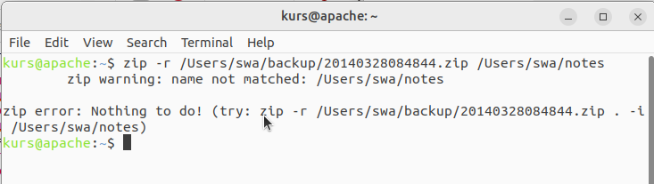
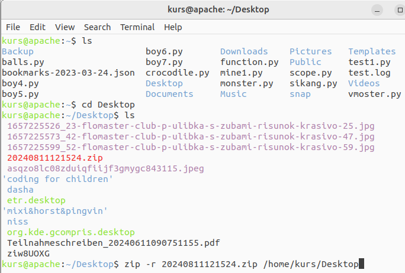

# Вирішення проблем
{w=40px}{bdg-secondary-line}`англійська:` _Problem Solving_

Ми розглянули різні частини мови Python, а тепер ми подивимося, як усі ці частини  поєднуються між собою, розробляючи та пишучи програму, яка _робить_ щось корисне.  Мета полягає в тому, щоб навчитися писати сценарії мовою Python самостійно.

## Проблема

Перед нами стоїть наступна проблема:

:::{attention}
Скласти програму, яка створює резервні копії всіх важливих файлів.
:::

Хоча це проста проблема (задача), нам недостатньо інформації, щоб почати її вирішення. Необхідний додатковий *аналіз*. Наприклад, як ми виберемо, _які_ файли копіювати? _Як_ їх зберігати? _Де_ їх зберігати?

Після належного аналізу проблеми, ми *проєктуємо * нашу програму. Ми складаємо список того, що має зробити наша програма. У цьому випадку я створив наступний список того, як _я_ уявляю її роботу. Коли ви проєктуєте програму, у вас може вийти інший результат, оскільки кожна людина уявляє собі це по-своєму, тож це цілком нормально.

- Файли та папки, які потрібно скопіювати, збираються до списку.
- Резервні копії повинні зберігатися у головній папці резервних копій.
- Резервні копії файлів зберігаються у файлі zip.
- Ім'я для zip-архіву - поточна дата та час.
- Будемо використовувати стандартну команду `zip`, доступну за замовчуванням у будь-якому стандартному дистрибутиві GNU/Linux або Unix. Зауважте, що ви можете використовувати будь-яку команду архівування, якщо вона має інтерфейс командного рядка.

:::{admonition} Для користувачів Windows
:class: note

Користувачі Windows можуть [встановити](http://gnuwin32.sourceforge.net/downlinks/zip.php) команду `zip` зі [сторінки проекту GnuWin32](https://gnuwin32.sourceforge.net/packages/zip.htm) і додати `C:\Program Files\GnuWin32\bin` до набору змінних середовища `PATH`, подібно до  того[ що ми зробили для розпізнавання самої команди python](./installation_ukr.md#dos-prompt).
:::

## Вирішення
{w=40px}{bdg-secondary-line}`англійська:` _The Solution_

Оскільки проєкт нашої програми зараз досить стабільний, ми можемо написати код, який є *реалізацією* нашого вирішення.


::::{admonition} код python [backup_ver1_ukr.py](programs/backup_ver1_ukr.py)
:::{literalinclude} programs/backup_ver1_ukr.py
:::
**Висновок**:
:::{literalinclude} programs/backup_ver1_ukr.txt
:::
::::

Зараз ми знаходимося на етапі *тестування*, де ми перевіряємо, чи наша програма працює належним чином. Якщо вона не поводиться так, як очікувалося, ми повинні *налагодити* (англ."debug") нашу програму, тобто видалити *помилки* (англ."bugs (errors) ") з програми.

Якщо наведена вище програма не працює для вас, скопіюйте рядок, надрукований після рядка `Zip command є` у висновку (zip -r /Users/swa/backup/20140328084844.zip /Users/swa/notes), вставте його в оболонку (у GNU/Linux і Mac OS X) / `cmd` (у Windows), подивіться, в чому полягає помилка, і спробуйте її виправити. Також перевірте посібник з команди "zip", щоб дізнатися, що може бути не так. Якщо ця команда виконується успішно, проблема може бути в самій програмі Python, тому перевірте, чи вона точно відповідає програмі, написаній вище.

**Як це працює**

Ви вже помітили, як ми крок за кроком перетворили наш *проєкт* на *код*.

Ми використовуємо модулі `os` і `time`, попередньо імпортувавши їх. Потім ми вказуємо файли та папки для резервного копіювання у списку  `джерело`. Цільова папка (англ."The target directory") – це місце, де ми зберігаємо всі файли резервних копій, і це вказано у змінній `цільова_папка`.  Ім’я zip-архіву, який ми збираємося створити, — це поточна дата й час, які ми генеруємо за допомогою функції `time.strftime()`. Він (архів) також матиме розширення `.zip` і зберігатиметься в папці `цільова_папка`.

Зверніть увагу на використання змінної `os.sep` - вона має роздільник шляху для папки,відповідно до вашої операційної системи, тобто це буде `'/'` у GNU/Linux, Unix, macOS, і буде `'\\'` у Windows. Використання `os.sep` замість цих символів безпосередньо зробить нашу програму переносимою та працюватиме в усіх цих системах.

Функція `time.strftime()` приймає як аргумент формат виводу часу (рядок певного вигляду), подібну до того, який ми використовували у наведеній вище програмі. Символ формата `%Y` буде замінено роком та століттям. Символ формата `%m` буде замінено місяцем у формі числа від `01` до `12` і так далі. Повний список таких символів формата можна знайти в [Довідковому посібнику Python](http://docs.python.org/3/library/time.html#time.strftime).

Ми створюємо назву цільового zip-файлу за допомогою додаткового оператора, який _конкатенує_ (англ."_concatenates_") рядки, тобто об’єднує два рядки разом і повертає новий. Потім ми створюємо рядок `zip_command`, який містить команду, яку ми збираємося виконати. Ви можете перевірити, чи ця команда працює, запустивши її в оболонці (термінал GNU/Linux або командний рядок DOS).

Команда `zip`, яку ми використовуємо, має кілька доступних параметрів, і одним із цих параметрів є `-r`. Параметр `-r` вказує, що команда zip має працювати **р**екурсивно (англ."recursive") для папок, тобто вона має включати всі підпапки та файли. За параметрами слідує ім'я zip-архіву, який потрібно створити, за ним вказується список   файлів і папок для резервного копіювання. Ми перетворюємо список джерел (англ."sourse") у рядок за допомогою методу об’єднання рядків (англ."join"), який ми вже бачили, як використовувати.

Потім ми нарешті *запускаємо* команду за допомогою функції `os.system`, яка запускає команду так, ніби її було запущено з *системи*, тобто із командної оболонки - вона повертає `0`, якщо команда виконана успішно, інакше вона повертає номер помилки.

Залежно від результату виконання команди ми друкуємо відповідне повідомлення про те, чи успішним було створення резервних копій чи ні.

Ось і все, ми створили сценарій для збереження резервних копій наших важливих файлів!

:::{admonition} Примітка для користувачів Windows
:class: note

Замість подвійної зворотної скісної риски ви також можете використовувати необроблені рядки. Наприклад, використовуйте `'C:\\Documents'` або `r'C:\Documents'`. Однак *не* використовуйте `'C:\Documents'`, оскільки в результаті ви використовуєте невідому екрановану послідовність `\D`.
:::

Тепер, коли у нас є робочий сценарій резервного копіювання, ми можемо використовувати його, коли захочемо зробити резервну копію файлів. Це називається  *операційною* фазою (англ."operation phase") або фазою *розгортання* (англ."deployment phase") програмного забезпечення.

Наведена вище програма працює належним чином, але (зазвичай) перші програми працюють не зовсім так, як ви очікуєте. Наприклад, можуть виникнути проблеми, якщо ви неправильно розробили програму або якщо ви зробили помилку під час введення коду тощо. Відповідно вам доведеться повернутися до фази проєктування або вам доведеться налагодити свою програму.

## Друга версія

Перша версія нашого сценарію працює. Однак ми можемо внести в нього деякі вдосконалення, щоб вона працювала краще щодня. Це називається фазою *супроводу* (англ."maintenance phase") програмного забезпечення.

Одне із вдосконалень, яке, як мені здається, буде корисними - це кращий механізм іменування файлів: використання _часу_ (англ."_time_") в якості імені файлу, що зберігається в папці з поточною _датою_ (англ."_date_") в якості імені, яке, у свою чергу, розташоване у головній папці для збереження резервного копіювання. Перша перевага полягає в тому, що ваші резервні копії зберігаються в ієрархічному порядку, тому ними набагато легше керувати. Друга перевага полягає в тому, що імена файлів набагато коротші. Третя перевага полягає в тому, що за іменами папок можна легко визначити, в які дні створювалися резервні копії, оскільки папка створюється лише у разі резервного копіювання даних у цей день.

Зберегти як `backup_ver2.py`:

::::{admonition} код python [backup_ver2_ukr.py](programs/backup_ver2_ukr.py) 
:::{literalinclude} programs/backup_ver2_ukr.py
:::
**Висновок**:
:::{literalinclude} programs/backup_ver2_ukr.txt
:::
::::

**Як це працює**

Більша частина програми залишається незмінною. Зміни полягають у тому, що ми перевіряємо, чи є папка з ім'ям, що відповідає поточній даті, в головній папці зберігання резервних копій за допомогою функції `os.path.exists`. Якщо ії не існує, ми створюємо ії за допомогою функції `os.mkdir`.

## Третя версія

Друга версія працює добре з великою кількістю резервних копій, але коли резервних копій стає багато, стає важко відрізнити, яка копія для чого! Наприклад, ми могли внести серйозні зміни в програму чи презентацію, тепер ми хочемо вказати суть цих змін в назві архіву zip. Цього можна легко досягти, додавши наданий користувачем коментар до назви zip-архіву.

ПОПЕРЕДЖЕННЯ: наступна програма не працює, тому не лякайтеся, просто пройдіть по ній, тому що в ній міститься урок.

::::{admonition} код python [backup_ver3_ukr.py](programs/backup_ver3_ukr.py) 
:::{literalinclude} programs/backup_ver3_ukr.py
:::
**Висновок**:
:::{literalinclude} programs/backup_ver3_ukr.txt
:::
::::

**Як це (не) працює**

*Ця програма не працює!* Python повідомляє, що є синтаксична помилка, яка означає, що сценарій не задовольняє структурі, яку очікує побачити Python. Коли ми спостерігаємо помилку, видану Python, він також повідомляє нам місце, де виявив помилку. Отже, ми починаємо *налагодження* (англ."*debugging*") нашої програми з цього рядка. 

Уважно спостерігаючи, ми бачимо, що один логічний рядок був розділений на два фізичних рядка, але ми не вказали, що ці два фізичні рядки є частиною одного. По суті, Python знайшов оператор додавання (`+`) без жодного операнда в цьому логічному рядку, і тому він не знає, як продовжити. Пам’ятайте, що ми можемо вказати, що логічний рядок продовжується в наступному фізичному рядку, використовуючи зворотну косу риску в кінці фізичного рядка. Отже, ми вносимо цю поправку в нашу програму. Це виправлення програми, коли ми знаходимо помилки, називається *виправленням помилок* (англ."*bug fixing*").

## Четверта версія

::::{admonition} код python [backup_ver4_ukr.py](programs/backup_ver4_ukr.py) 
:::{literalinclude} programs/backup_ver4_ukr.py
:::
**Висновок**:
:::{literalinclude} programs/backup_ver4_ukr.txt
:::
::::

**Як це працює**

Ця програма тепер працює! Розглянемо фактичні вдосконалення, які ми зробили у версії 3. Ми беремо коментарі користувача за допомогою функції `input`, а потім перевіряємо, чи дійсно користувач щось ввів, з’ясовуючи довжину введення за допомогою функції `len`. Якщо користувач щойно натиснув `enter`, не вводячи нічого (можливо, це було просто звичайне резервне копіювання або не було зроблено жодних спеціальних змін), тоді ми продовжуємо, як робили раніше.

Однак, якщо було надано коментар, він додається до імені zip-архіву безпосередньо перед розширенням `.zip`. Зверніть увагу, що ми замінюємо пробіли в коментарях на підкреслення - це тому, що керувати іменами файлів без пробілів набагато легше.

## Більше уточнень

Четверта версія є задовільно робочим сценарієм для більшості користувачів, але завжди є місце для вдосконалення. Наприклад, ви можете включити рівень _дослівності_ (англ."_verbosity_ level") для команди zip, вказавши опцію `-v`, щоб зробити вашу програму більш балакучою (англ."talkative"), або опцію `-q`, щоб зробити її _тихою_ (англ."quiet").

Ще одним можливим покращенням була б можливість передавати сценарію інші файли та папки прямо у командному рядку. Ми можемо отримати ці імена зі списку `sys.argv` і додати їх до нашого списку `джерело` за допомогою методу `extend`, який надається класом `список`(англ."list").

Найважливішим удосконаленням було б не використовувати спосіб створення архівів `os.system`, а натомість використовувати [zipfile](http://docs.python.org/3/library/zipfile.html) або [tarfile]( http://docs.python.org/3/library/tarfile.html) - вбудовані модулі для створення цих архівів. Вони є частиною стандартної бібліотеки та вже доступні для використання без зовнішніх залежностей від програми zip, доступної на вашому комп’ютері.

Однак я використовував спосіб `os.system` для створення резервної копії у наведених вище прикладах суто з педагогічною метою, так що приклад достатньо простий, щоб його зрозуміли всі, але достатньо реальний, щоб бути корисним.

Чи можете ви спробувати написати п’яту версію, яка використовує модуль [zipfile](http://docs.python.org/3/library/zipfile.html) замість виклику `os.system`?

## Процес розробки програмного забезпечення

Зараз ми пройшли різні *етапи* в процесі написання програмного забезпечення. Ці фази можна підсумувати таким чином:

1. Що (Аналіз)
2. Як (Проєктування )
3. Зроби це (Реалізація)
4. Тестування (Тестування та Налагодження)
5. Використання (Оперування та Розгортання)
6. Супровід (Вдосконалення)

Рекомендований спосіб написання програм — це процедура, якої ми дотримувалися під час створення сценарію резервного копіювання: виконайте аналіз і проєктування. Почніть реалізацію з простого варіанту. Протестуйте та налагодьте його. Використовуйте його, щоб переконатися, що він працює належним чином. Тепер додайте будь-які функції, які вам потрібні, і продовжуйте повторювати цикл «Зроби-тест-використай» стільки разів, скільки потрібно.

Пам'ятайте:

> Програмне забезпечення вирощують, а не створюють.
> -- [Bill de hÓra](http://97things.oreilly.com/wiki/index.php/Great_software_is_not_built,_it_is_grown)

## Резюме

Ми побачили, як створювати власні програми/сценарії на Python, а також різні етапи написання таких програм. Вам може бути корисно створити власну програму, як ми робили в цьому розділі, щоб ви навчилися працювати з Python, а також вирішувати проблеми.

Далі ми обговоримо об'єктно-орієнтоване програмування.


## -- Доповнення від перекладача --

Перший приклад не буде працювати на вашему комп'ютері,якщо ви не змінили Swaroop Path (/Users/swa/notes) на ваш Path.

* _Головна_  або _коренева_  папка, каталог (англ."англ.root directory","root folder")- це перша папка в операційній системі. У Linux і MacOS це "/" або "/home/username". У Windows це зазвичай "C:\"

* Шлях файлу (англ. "Path") - це рядок із іменами всіх папок (а також підпапок і підпідпапок...), починаючи з кореневої папки до поточної папки. Зауважте, що в WINDOWS назви папок відокремлюються зворотною скісною рискою(бекслеш), як-от "C:\carl\documents", але в Linux і MacOS назви папок відокремлюються скісною рискою(слеш): "/home/carl/documents".

Swaroop пояснює,що якщо наведена вище програма не працює для вас, скопіюйте рядок, надрукований після рядка `Zip command є` у висновку (zip -r /Users/swa/backup/20140328084844.zip /Users/swa/notes), вставте його в оболонку (у GNU/Linux і Mac OS X) / `cmd` (у Windows), подивіться, в чому полягає помилка, і спробуйте її виправити.

Як це зробити?

Щоб відкрити термінал у Linux ,треба використати наступну комбінацію: Strg + Alt + T


Якщо ви хочете перевірити,які файли у вас у головній папці,треба ввести ls (англ."list files").
Якщо хочете перейти в якусь субпапку треба ввести сd (chance directory)  та назву субпапки.




На моєму комп'ютері перший приклад працює у наступному виконанні:


```python
import os
import time

# 1.Файли та папки, які потрібно скопіювати, збираються до списку.
# Приклад у  Windows:
# джерело = ['"C:\\My Documents"']
# Приклад у  Mac OS X and Linux:
джерело = ['/home/kurs/Documents']
# Зауважте, що ми повинні використовувати подвійні лапки всередині рядка для імен із пробілами.
# Ми також могли використати необроблений рядок,
# написавши [r'C:\My Documents'].

# 2. Резервні копії повинні зберігатися у головній папці резервних копій
# Приклад у  Windows:
# цільова_папка (англ."target_dir",target directory = 'E:\\Backup'
# Приклад у  Mac OS X and Linux:
цільова_папка = '/home/kurs/Desktop/byte_of_python_ps'
# Не забудьте замінити шлях `/Users/swa/backup` вашими власними назвами папок.

# 3. Резервні копії файлів зберігаються у файлі zip.
# 4. Ім'я для zip-архіву - поточна дата та час.
ціль = цільова_папка + os.sep + \
         time.strftime('%Y%m%d%H%M%S') + '.zip'

# Створіть цільову папку, якщо її немає
if not os.path.exists(цільова_папка):
    os.mkdir(цільова_папка)  #створити папку

# 5. Ми використовуємо команду zip, щоб помістити файли в zip-архів
zip_command = 'zip -r {0} {1}'.format(ціль,
                                      ' '.join(джерело))

# Запускаємо створення резервної копії
print('Zip command є:')
print(zip_command)
print('Запуск:')
if os.system(zip_command) == 0:
    print('Резервна копія успішно створена', ціль)
else:
    print('Створення резервної копії НЕ ВДАЛОСЯ')

```
Висновок:
```
$ python backup_ver1.py
Zip command є:
zip -r /Users/swa/backup/20140328084844.zip /Users/swa/notes
Запуск:
  adding: home/kurs/Documents/dasha_learning_python/vpython/presentation/fotos/demo/reveal.js-master/examples/math.html (deflated 74%)
  adding: home/kurs/Documents/dasha_learning_python/vpython/presentation/fotos/demo/reveal.js-master/examples/media.html (deflated 64%)

Резервна копія успішно створена  /home/kurs/Desktop/byte_of_python_ps/20240813213524.zip

```


--- __завершення доповнень від перекладача__ ---