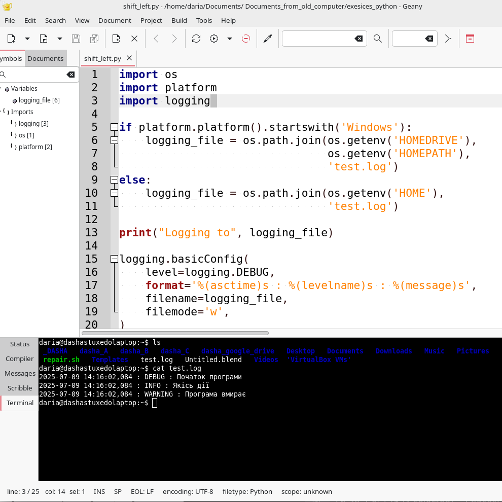

# Стандартна бібліотека
{w=40px}{bdg-secondary-line}`англійська:` _Standard Library_

Стандартна бібліотека Python містить величезну кількість корисних модулів і є частиною кожної стандартної інсталяції Python. Важливо ознайомитися зі стандартною бібліотекою Python, оскільки багато проблем можна швидко вирішити, якщо ви знайомі з можливостями цих бібліотек.

Ми розглянемо деякі з часто використовуваних модулів у цій бібліотеці. Ви можете знайти повну інформацію про всі модулі стандартної бібліотеки Python у [розділі «Довідник бібліотеки»(англ."Library Reference")](http://docs.python.org/3/library/) документації, яка постачається разом із інсталяцією Python.

Давайте розглянемо кілька корисних модулів.

:::{warning}
якщо ви вважаєте теми цього розділу занадто складними, ви можете пропустити цей розділ. Однак я настійно рекомендую повернутися до цього розділу, коли вам стане зручніше програмувати на Python.
:::
 

## модуль `sys`
{w=40px}{bdg-secondary-line}`англійська:` _`sys` module_) 

Модуль `sys` містить функціональність, характерну для системи. Ми вже бачили, що список `sys.argv` містить аргументи командного рядка.

Припустімо, ми хочемо перевірити версію використовуваного програмного забезпечення Python, модуль `sys` надає нам цю інформацію.

<!-- Результат має відповідати змінній pythonVersion у book.json -->

```python
>>> import sys
>>> sys.version_info
sys.version_info(major=3, minor=6, micro=0, releaselevel='final', serial=0)
>>> sys.version_info.major == 3
True
```

**Як це працює**

Модуль `sys` має кортеж `version_info`, який надає нам інформацію про версію. Перший запис (major=3) — основна версія. Ми можемо отримати цю інформацію, щоб використати її.

## Модуль `logging`
{w=40px}{bdg-secondary-line}`англійська:` _`logging` module_

Уявіть ситуацію, коли необхідно зберегти деякі налагоджувальні або інші важливі повідомлення де-небудь,щоб мати можливість пізніше перевірити, чи ваша програма працює так, як ви цього очікували? Як саме «зберігати десь» ці повідомлення ? Цього можна досягти за допомогою модуля `logging`.

::::{admonition} код python [stdlib_logging_ukr.py](programs/stdlib_logging_ukr.py)
:::{literalinclude} programs/stdlib_logging_ukr.py
:::
**Висновок**:
:::{literalinclude} programs/stdlib_logging_ukr.txt
::::


Щоб переглянути та вивчити файл test.log, просто відкрийте його в будь-якому текстовому редакторі. Якщо вам зручно працювати в терміналі, у вашій операційній системі зазвичай є команда для відображення текстового файлу. У Linux та MacOS ця команда називається cat.



**Як це працює**

Ми використовуємо три модулі зі стандартної бібліотеки: модуль `os` для взаємодії з операційною системою, модуль `platform` для отримання інформації про платформу, тобто операційну систему, і модуль `logging` для *логування* інформації (англ." to log information").

Спочатку ми перевіряємо, яку операційну систему ми використовуємо, перевіряючи рядок, який повертає функція `platform.platform()` (для отримання додаткової інформації див. `import platform; help (platform)`). Якщо це Windows, ми визначаємо home drive (диск) ,який містить домашню папку та назву файлу, де ми хочемо зберігати інформацію. Зібравши ці три частини разом, ми отримаємо повне розташування файлу. Для інших платформ нам потрібно знати лише домашню папку користувача, і ми отримаємо повний шлях до файлу.

Ми використовуємо функцію `os.path.join()`, щоб поєднати ці три частини шляху. Причина використання спеціальної функції, а не простого додавання рядків разом, полягає в тому, що ця функція гарантує, що повний шлях відповідає формату, очікуваному операційною системою. 

Примітка : метод `join()`, який ми використовуємо тут є частиною модуля `os`,він відрізняється від рядкового методу `join()`, який ми використовували в інших частинах цієї книги.

Ми налаштовуємо модуль `logging` для запису всіх повідомлень у певному форматі у вказаний файл.

Нарешті, ми можемо виводити повідомлення, призначені для налагодження, інформування, попередження та навіть критичні повідомлення. Після запуску програми ми можемо перевірити цей файл і знати, що сталося в програмі, навіть якщо користувач, який запускає програму, не показує жодної інформації.

## Модуль серії тижня
{w=40px}{bdg-secondary-line}`англійська:` _Module of the Week Series_ 

У стандартній бібліотеці, як-от  [налагодження (англ."debugging")](http://docs.python.org/3/library/pdb.html),
[обробка параметрів командного рядка(англ."handling command line options")](http://docs.python.org/3/library/argparse.html), [регулярні вирази(англ."regular expressions")](http://docs.python.org/3/library/re.html) є ще багато чого для вивчення.

Найкращий спосіб глибше вивчити стандартну бібліотеку — це прочитати чудову серію Doug Hellmann ["Модуль тижня" (англ."Python Module of the Week")](http://pymotw.com/2/contents.html) (також доступна як [книга](http://amzn.com/0321767349))або  [Офіційну документацію Python](http://docs.python.org/3/).

## Резюме

Ми дослідили деякі функції багатьох модулів стандартної бібліотеки Python. Настійно рекомендуємо переглянути [документацію стандартної бібліотеки Python](http://docs.python.org/3/library/), щоб отримати уявлення про всі доступні модулі.

Далі ми розглянемо різні аспекти Python, які зроблять наш огляд Python більш _повним_.
